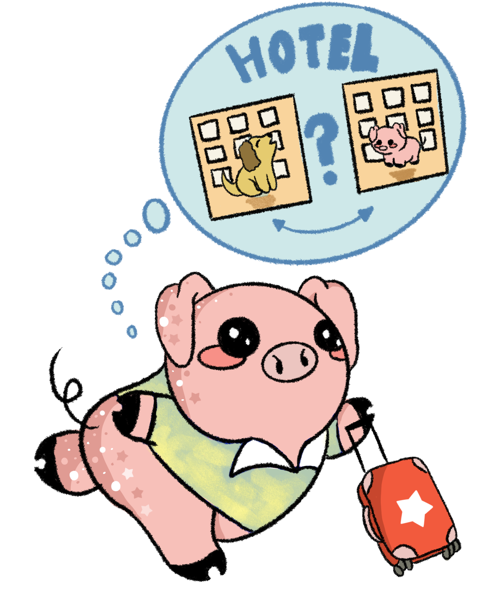
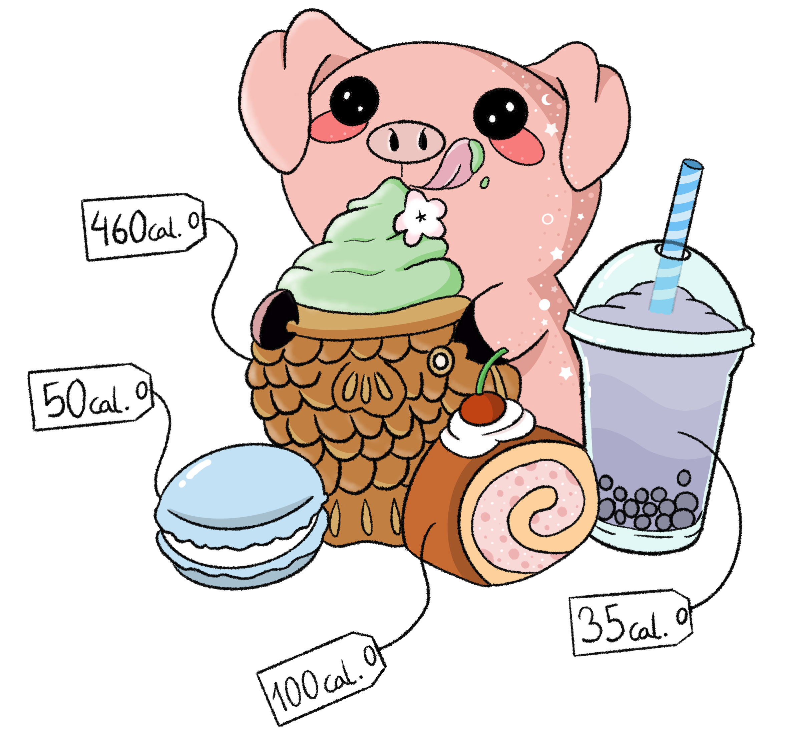
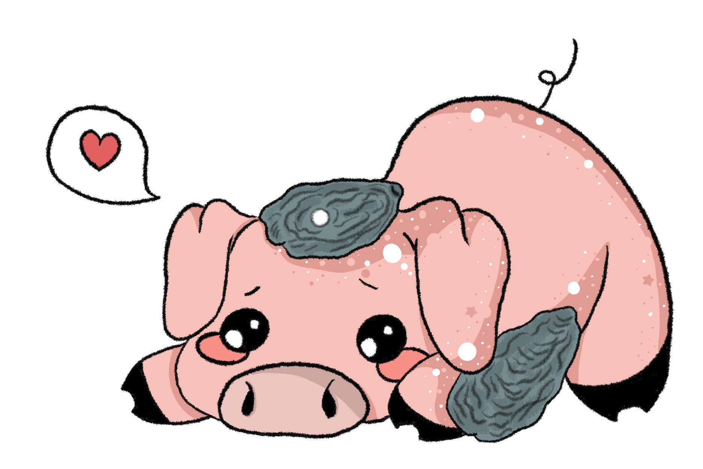
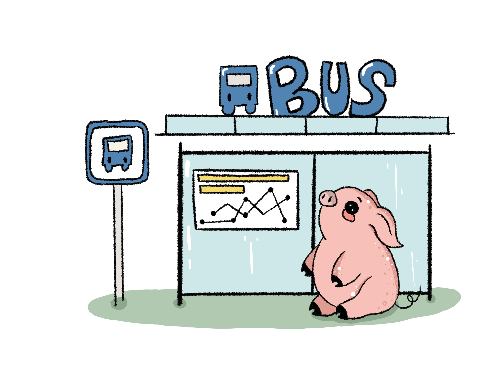

Algorithms and data structures sound intimidating, especially when they are one of the most important parts of the interview process. I was also not very fond of them, until I tried out different studying methods and found one that works well.

Like many people, I had troubles solving an old question I saw weeks ago. I knew I studied the solution before, but the question still looks unfamiliar. Binge doing a bunch of questions without a deep understanding is not a good use of time. 


Instead, I listed down some of my weakest algorithms/data structures and studied just a few problems in each category. To motivate me, my fiancé created some cute algorithmic questions that feature pig and dog. In this blog post, I am going to share twelve of such problems. This is by no means an exhaustive list of problem types, but I focus mainly on these common ones.

The solutions are written in Python and posted to my GitHub repo. Hope that you enjoy them as well. 

------

### 1. Dog Meets Idols


Dog wants to meet as many idols as possible at a conference. He has to sleep 12 hours every day but can choose when to sleep. Each idol appears at a fixed time every day, and Dog sleeps for 12 hours at the same time every day. Assume dog has at most $10^6$ idols and each of them show up at a time (float) t such that $0 \leq t \leq 24$, how many idols can he meets given a list of showup time in `idols`?

Example 1: 

```
Input: idols = [1, 2, 3, 4]
Output: 4
```

Example 2:

```
Input: idols = [0, 12]
Output: 2
```

[Link to solution](https://github.com/Sugarc0de/pig-coding-questions/blob/main/dog_meets_idols.py)

### 2. Dog Optimizes Cooking Time


Dog wants to optimize cooking time so that he can cook as fast as possible. Given each ingredient in a tuple (ingredient_name, preparation_duration, cooking_duration), input `t` is a list of ingredient tuples. For example, `t = [('meat', 4, 7), ('pepper', 5, 3), ('cabbage', 5, 2), ('green onions', 1, 1)]`. In the above example, it takes 4 minutes to prepare meat, and 7 minutes to cook it.

Find the minimum time it takes to cook everything. Assume dog can only prepare one ingredient at a time, but is able to cook multiple things at the same time. And he can prepare the next item while cooking.

Exmple 1: 

```
Input: t = [('meat', 4, 7), ('pepper', 5, 3), ('cabbage', 5, 2), ('green onions', 1, 1)]
Output: 16
```

[Link to solution](https://github.com/Sugarc0de/pig-coding-questions/blob/main/dog_optimizes_cooking_time.py)

### 3. Pig and Dog Rotate Cooking


Pig likes to cook as it is relaxing, but sometimes she would want Dog to cook instead. When both of them feel lazy, they order takeout. Within a period of `day` (1 <= `day` <= 100), Dog would cook no more than `d_max` days, and they would not order more than `t_max` days of takeout. Pig is happy to cook no matter what. How many unique ways can Pig and Dog arrange the cooking plan?

Example 1:

```
Input: day = 2, d_max = 1, t_max = 1
Output: 7
Explanation: There are 7 unique ways in total. And they are
[(pig, pig), (pig, dog), (dog, pig), (pig, takeout), (takeout, pig), (takeout, dog), (dog, takeout)]
```

[Link to solution](https://github.com/Sugarc0de/pig-coding-questions/blob/main/pig_and_dog_rotate_cooking.py)

### 4. Pig Books Hotels



Pig goes on a road trip and wants to book a hotel for Pig and one for Dog. The distance between the two hotels must have distance <= D, and they cannot book the same hotel. Find out how many ways can she accommodate this. The input `hotels` is a list of hotel locations (eg: [0, -3.2, 5.5, 7], they are all on a line) and `D` is an integer.

Example 1:

```
Input: hotels = [-1, -3, 0, 4, 5], D = 2
Output: 3 
```

Example 2:

```
Input: hotels = [1, 4, 6, 9, 11], D = 1
Output: 0
```

[Link to solution](https://github.com/Sugarc0de/pig-coding-questions/blob/main/pig_books_hotels.py)

### 5. Pig Buys PigCoins


Pig wants to follow the trend and invest in Pigcoin. She has `M` cashes,
and assume she knows the future exchange rates, note that exchange rate = how much cash is 1 Pigcoin equal to. Assume that future exchange rates are given in a list, for example, `rates` = [2, 0.5, 1.1], 2 means on the first day $2 is worth 1 Pigcoin. She can perform at most one transaction in a day, and the trading platform would charge her extra `K` fees for each transaction. Calculate maximum cash pig can earn at the end of the last day.

Example 1: 

```
Input: rates = [5], M = 2, K = 3
Output: 2
```

Example 2:

```
Input: rates = [1, 5], M = 13, K = 3
Output: 47
Explanation: The strategies would be to buy 10 pigcoins on day 1, and sell them on day 2. Consider the transaction fees on both days, max_cash = (13 - 3) * 1 * 5 - 3 = 47.
```

[Link to solution](https://github.com/Sugarc0de/pig-coding-questions/blob/main/pig_buys_pigcoins.py)

### 6. Pig Eats Desserts



Pig wants to order 2 desserts from the menu, and each dessert comes with the number of calories. Find the number of ways that pig can order 2 desserts with at least `M` calories (The supply is limited so pig can not order the same dessert twice). For example, `desserts` = [2, 4, 5, 1, 1, 4, 4, 7], and `m` = 6. In the case above, pig can choose dessert 0 (calories=2) combined with dessert 1 (calories=4) since the sum >= `m`.

Example 1:

```
Input: desserts = [2, 2, 2, 2], m = 4
Output: 6
```

Example 2:

```
Input: desserts = [1, 4, 5, 3, 2, 1], m = 10
Output: 0
```

[Link to solution](https://github.com/Sugarc0de/pig-coding-questions/blob/main/pig_eats_desserts.py)

### 7. Pig Climbs Tree


One day, Pig wants to climb a tree so that she can enjoy the scenery.
A tree has different branches with different lengths, and Pig can only climb with no more than target effort. For example, given input `tree =[('A', 'B', 3), ('A', 'C', 1), ('B', 'D', 6), ('B', 'E', 1), ('C', 'F', 2),('D', 'G', 3), ('E', 'H', 4), ('F', 'I', 5)]` and `target`=6. Tree visualization is as follows: 

```
    G         H            I
  (3)\       / (4)        / (5)
      D     E            F
    (6) \  / (1)        / (2)
          B            C
        (3)\         / (1)

                A
```

In the above example, Pig starts from node A and wants to climb
up to any of the leaf node (number next to each branch represents the distance). A leaf node is defined as a node where it does not point to any other node. Return the number of unique ways Pig can reach to any of the leaf node.

Example 1: 

```
Input: tree =  [('A', 'B', 3), ('A', 'C', 1), ('B', 'D', 6), ('B', 'E', 1), ('C', 'F', 2), ('D', 'G', 3), ('E', 'H', 4), ('F', 'I', 5)] and target = 6
Output: 0 # impossible to reach 
```

Example 2: 

```
Input: tree =  [('A', 'B', 3), ('A', 'C', 1), ('B', 'D', 6), ('B', 'E', 1), ('C', 'F', 2), ('D', 'G', 3), ('E', 'H', 4), ('F', 'I', 5)] and target = 10 
Output: 2
```

[Link to solution](https://github.com/Sugarc0de/pig-coding-questions/blob/main/pig_climbs_tree.py)

### 8. Pig Finds Max Oysters



Pig is an oyster lover and she is given a grid of different kinds of oysters. Find the area of the biggest square of oysters of the same kind. Example 1: 

```
Input: grid = [
[2, 2, 2, 8],
[2, 2, 2, 2],
[2, 2, 2, 2],
[2, 2, 2, 2],
[2, 2, 2, 2]
]
Output: 16
Explanation: The area of the biggest square of oysters is 16 (4x4 of type 2).
```

Example 2: 

```
Input: grid = [
    [1, 1, 2, 3, 5],
    [2, 3, 3, 4, 1],
    [1, 3, 3, 6, 1],
    [4, 4, 4, 4, 5],
    [4, 4, 4, 1, 2],
    [4, 4, 4, 6, 6],
]
Output: 9
```

[Link to solution](https://github.com/Sugarc0de/pig-coding-questions/blob/main/pig_finds_max_oysters.py)

### 9. Pig Hits a Wall


Pig loves oysters and she has a map with an oyster somewhere. However, Pig cannot turn her head until hitting the wall. She is free to change her direction once she hits a wall. Assume the map is a
2D grid, where **.** means walkable cell, **#** means wall, **9** means oyster, and **1** is where Pig is located. Return the minimum distance she has to travel in order to reach the oyster. If oyster cannot be reached, return -1.

Example 1: 

```
Input: grid = [['9', '.', '#'],
               ['#', '.', '.'],
               ['.', '#', '.'],
               ['1', '.', '.']]
Output: 7
```

Example 2:

```
Input: grid = [['.', '.', '.'],
               ['#', '9', '.'],
               ['.', '#', '.'],
               ['1', '.', '.']]
Output: -1 
```

[Link to solution](https://github.com/Sugarc0de/pig-coding-questions/blob/main/pig_hits_the_wall.py)

### 10. Pig Finds Shortest Transit



Pig wants to take minimum number of transit from bus stop A to bus stop B, and she is given a list of bus stops with transit stops. For example, 

```
routes_map = {
            "yonge":["A", "B", "C", "D", "E"],
            "bay":["C", "D", "G", "Y", "K"],
            "dundas":["I", "O", "K", "G", "F"],
            "king":["K","F","M","N"]
        }
```

Assume the bus goes from left to right, ie, if Pig gets on the route "dundas" at stop K, her next stop is G. Find the least number of transit lines she has to go through.

Example 1: 

```
Input: routes_map = {
            "yonge":["A", "B", "C", "D", "E"],
            "bay":["C", "D", "G", "Y", "K"],
            "dundas":["I", "O", "K", "G", "F"],
            "king":["K","F","M","N"]
        }, start = "A" and end = "M"
Output: 3
```

Example 2:

```
Input: routes_map = {
            "yonge":["A", "B", "C", "D", "E"],
            "bay":["C", "D", "G", "Y", "K"],
            "dundas":["I", "O", "K", "G", "F"],
            "king":["K","F","M","N"]
        }, start = "B" and end = "I"
Output: -1
```

[Link to solution](https://github.com/Sugarc0de/pig-coding-questions/blob/main/pig_finds_shortest_transit.py)

### 11. Pig Plays the Piano


Pig wants to play a piano piece consisting of a set of notes with (start_time, duration_time, note). She can play the song if the song never has two notes simultaneously with distance more than 10 apart (Pig can only play with one paw). Return True if she can play the song, otherwise False.

Example 1: 

```
Input: notes = [(50, 0, 10), (58, 5, 10), (65, 8, 10)]
Output: False
Explanation: notes 1 and 3 are overlapping
```

Example 2:

```
Input: notes = [(50, 0, 10), (58, 5, 10), (48, 8, 10), (40, 1, 3)]
Output: True
Explanation: lots of notes but no overlap
```

[Link to solution](https://github.com/Sugarc0de/pig-coding-questions/blob/main/pig_plays_the_piano.py)

### 12. Pig Switches Job


Given a list of jobs with (pay, happiness), find out the longest
job sequence such that Pig's next job has either higher pay or higher happiness. Assume that Pig cannot go back to her previous job, and no two jobs have the same (pay, happiness). There could be multiple job sequence as answers so just output one of them. 

Example 1: 

```
Input: jobs = [(60, 6), (60, 7), (60, 4), (20, 3), (10, 1), (100, 8), (120, 5)]
Output: [(10, 1), (20, 3), (60, 4), (60, 6), (100, 8), (120, 5), (60, 7)]
```

[Link to solution](https://github.com/Sugarc0de/pig-coding-questions/blob/main/pig_switches_job.py)


------


Above are the twelve fun questions I used for practice. While it is definitely true that practice makes perfect, be mindful of what types of question you are practicing and keep track of your progress. Hope that this blog post can inspire someone out there and make studying for algorithms a bit more pleasant!

*Thanks to [Bai Li](http://www.cs.toronto.edu/~bai) for coming up with the questions and [Naza](https://www.fiverr.com/nazacharms) for the illustrations!*
